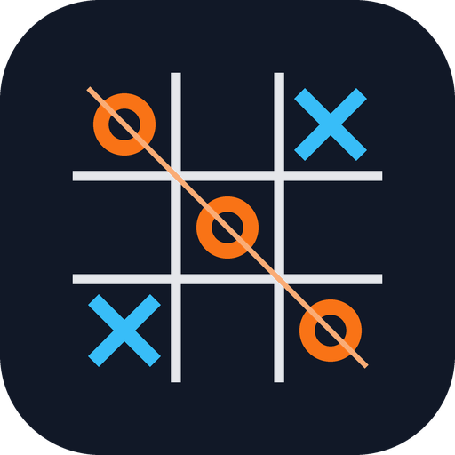
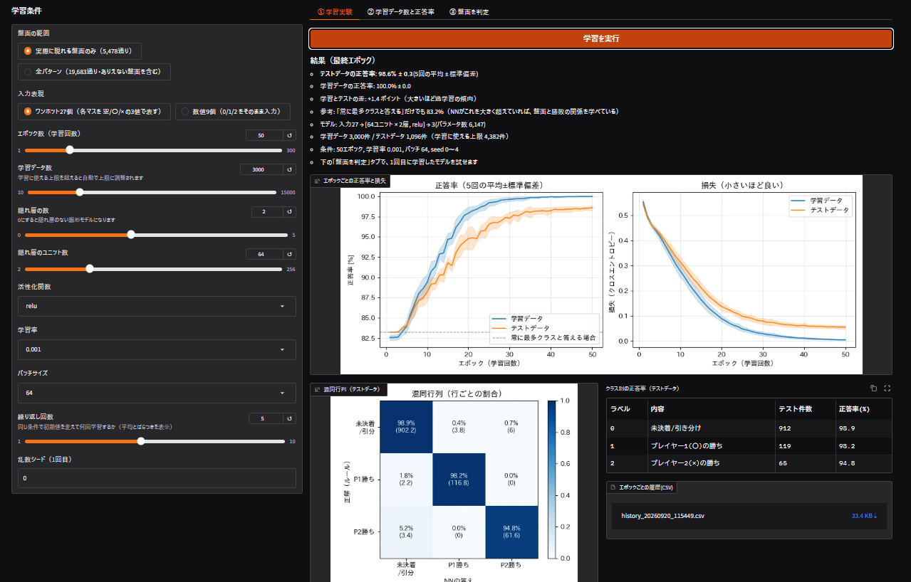
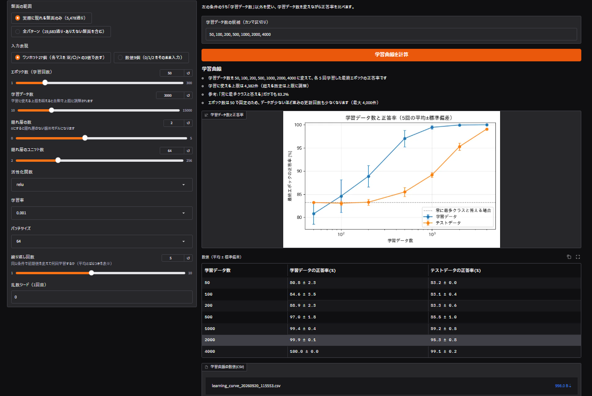
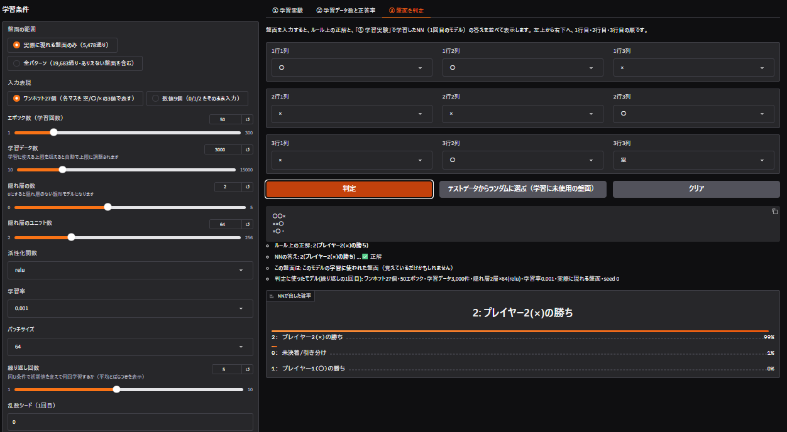

<p align="center">
  
</p>

# tictactoe-nn-lab　〇×ゲームで試すニューラルネットワーク実験

[](https://colab.research.google.com/github/pale76/tictactoe-nn-lab/blob/main/notebooks/colab_demo.ipynb)

## このプロジェクトについて

〇×ゲームの盤面を題材に、**ニューラルネットワーク（NN）が盤面と勝敗の関係を、学習によってどこまで学べるか**を実験するアプリです。
勝敗判定そのものが目的ではなく、学習データ数・エポック数（学習回数）・入力表現・ネットワーク構成を変えたときに、
**初めて見る盤面に対する正答率がどう変わるか**を観察することが目的です。

- 盤面（9マス）と正解ラベル（未決着/引き分け・プレイヤー1の勝ち・プレイヤー2の勝ち）は、ルールからプログラムが自動生成します
- PyTorch で NN を学習し、Gradio の Web 画面で条件の設定・結果の確認ができます
- Google Colab でそのまま動きます

| 学習実験（タブ①） | 学習データ数と正答率（タブ②） |
|---|---|
|  |  |

## できること

- 学習条件を設定して学習（盤面の範囲・入力表現・エポック数・学習データ数・隠れ層の数・ユニット数・活性化関数・学習率・バッチサイズ）
- エポックごとの正答率と損失の推移をグラフ表示（学習データとテストデータの両方）
- 同じ条件を複数回（初期値を変えて）実行し、平均とばらつきを表示
- 混同行列とクラスごとの正答率の表示
- 学習データ数と正答率の関係（学習曲線）の表示
- 盤面を入力して、NN の判定（3クラスの確率）とルール上の正解を並べて確認
- 結果の CSV 保存

## 実行方法

### Google Colab で動かす

1. [`notebooks/colab_demo.ipynb`](notebooks/colab_demo.ipynb) を Colab で開く（上の「Open in Colab」ボタン、または Colab にノートブックをアップロード）
2. セルを上から順に実行する（手順1で、このリポジトリを GitHub から自動で取得します）
   - ZIP で試す場合は、Colab 左のファイル欄から `/content` に ZIP をドラッグ&ドロップしてから、手順1のセルを実行します（ZIP があれば、そちらが優先されます）
3. 最後のセルで Gradio の画面が表示される

> **公開リンクについて**　Colab では、Gradio が自動で公開リンク（`https://….gradio.live`）を作ることがあります。
> リンクを知っている人は誰でも画面を開けます。他の人に送らず、使い終わったらセルを停止してください。

### 自分のPCで動かす

Python 3.10 以上を想定しています。

```bash
git clone https://github.com/pale76/tictactoe-nn-lab.git
cd tictactoe-nn-lab
pip install -r requirements.txt
python src/main.py                # 表示された URL（通常 http://127.0.0.1:7860）をブラウザで開く
```

オプション: `--port 8000`（ポート指定）、`--share`（公開リンクを作る）

### テスト

```bash
pip install -r requirements-dev.txt
python -m pytest -q
```

盤面が 5,478 通りになること、勝敗ラベルが正しいこと（終局盤面が P1 勝ち 626・P2 勝ち 316・引き分け 16 通り）、テストデータが学習に混ざらないこと、`data/sample.csv` がルールと一致していることなどを確認します。PyTorch が入っていない環境では、学習まわりのテストは自動でスキップされます。

## 画面の使い方

左の「学習条件」は3つのタブで共通です。右のタブで実行します。

| タブ | できること |
|---|---|
| ① 学習実験 | 条件を決めて学習。正答率・損失のグラフ、混同行列、クラス別正答率、エポックごとの履歴 CSV |
| ② 学習データ数と正答率 | 学習データ数を変えながら学習し、学習曲線を表示。数値の CSV も保存可能 |
| ③ 盤面を判定 | 3×3 のドロップダウンで盤面を入力し、ルール上の正解と NN の答え（確率）を並べて表示。その盤面が学習に使われたか、判定に使ったモデルの条件も表示。「テストデータからランダムに選ぶ」で、学習に使っていない盤面を試せる |

タブ③で使うのは、直前にタブ①で学習したモデル（繰り返しの1回目）です。**先にタブ①を実行してください。**



上の例は、ルール上プレイヤー2の勝ち（右上から左下の斜めに×が並ぶ）の盤面を、NN が 99% の確率で「プレイヤー2の勝ち」と正しく答えた場面です。
この盤面は、このモデルの学習に使われたものなので、覚えているだけかもしれません。初めて見る盤面での判定を試すには、「テストデータからランダムに選ぶ」を押してください。

## 実験結果の例

入力表現とエポック数を変えて実験した結果です（実際に Colab で実行した値。学習データ 3,000 件、隠れ層 2 層×64、relu、5 回の平均）。詳細は [docs/experiments.md](docs/experiments.md) を参照してください。

| | ワンホット27個<br>50エポック | 数値9個<br>50エポック | 数値9個<br>300エポック |
|---|---|---|---|
| テストの正答率 | **98.6%** ± 0.3 | 85.5% ± 0.9 | 85.9% ± 0.8 |
| 学習データの正答率 | 100.0% | 88.7% ± 1.1 | 99.9% ± 0.1 |

**基準の正答率は 83.2%** です（何も学習せず、常に「未決着/引き分け」と答えた場合）。

- 同じ条件で入力表現だけを変えると、正答率が大きく変わりました（ワンホット 98.6% と、数値 85.5%）
- 数値9個では、エポックを 6 倍にしても、テストの正答率は上がりませんでした（学習データの正答率だけが上がり、過学習が進みました）
- ワンホットでは、学習データが 200 件までは基準と同程度で、500 件から基準を超え、4000 件で 99.1% になりました

※これは、1つの学習/テスト分割・1つのネットワーク構成での結果です。

## データと実験の設計（要点）

| 項目 | 内容 |
|---|---|
| 盤面 | 9 マスを左上→右下の順に並べた 0/1/2（0=空白、1=プレイヤー1〇・先手、2=プレイヤー2×） |
| ラベル | 0=未決着または引き分け、1=プレイヤー1の勝ち、2=プレイヤー2の勝ち |
| 盤面の範囲 | 既定は「実際のゲームで現れる盤面」5,478 通り。切り替えで全パターン 19,683 通りも選べる |
| 学習/テスト | 8:2 に分割。テストデータは乱数シード固定の共通セットで、**学習には一切使わない** |
| 入力表現 | 「0/1/2 をそのまま 9 個」または「ワンホット 27 個」 |
| モデル | PyTorch の全結合 NN（隠れ層 0〜5 層）。最適化は Adam、損失はクロスエントロピー |
| 複数回実行 | 同じ条件を繰り返し（既定 5 回）、平均と標準偏差を表示 |

### 結果を読むときの注意

- **基準の正答率を必ず確認してください。** ラベル 0 が全体の約 83% を占めるため、常に「0」と答えるだけで約 83% になります。基準を大きく上回ってはじめて「学習できている」と言えます。
- 正答率が高くても、クラスごとの正答率（特にプレイヤー2の勝ち。テストデータで 65 件）が低いことがあります。混同行列も見てください。
- 学習曲線（タブ②）は、エポック数を固定して比べます。学習データが少ないほど、重みの更新回数も少なくなります。
- 「全パターン」には、〇×どちらも 3 つ並んでいる盤面（実際には起こらない）が含まれます。このラベルは 0 としています。
- 「実際に現れる盤面のみ」と「全パターン」では、テストデータの中身が異なるため、正答率を直接比較できません。

詳しくは [docs/design.md](docs/design.md) を参照してください。

## ディレクトリ構成

```
tictactoe-nn-lab/
├── README.md
├── AGENTS.md              # coding agent 向けの作業ガイド（AI の利用についても記載）
├── requirements.txt       # 実行に必要なライブラリ
├── requirements-dev.txt   # テスト用（pytest を追加）
├── LICENSE
├── conftest.py            # pytest が src/ を見つけられるようにするためのファイル
├── src/
│   ├── main.py            # 起動用スクリプト
│   ├── make_sample_data.py# data/sample.csv を作り直す
│   └── tictactoe_nn/
│       ├── game.py        # 盤面生成・勝敗ラベル付け
│       ├── data.py        # データ分割・入力表現の変換
│       ├── model.py       # ニューラルネットワーク（PyTorch）
│       ├── train.py       # 学習・評価・複数回実行・学習曲線
│       ├── plots.py       # グラフ作成
│       └── app.py         # Gradio 画面
├── data/
│   └── sample.csv         # 盤面 5,478 通りと正解ラベル、学習/テストの区分
├── assets/
│   ├── images/logo.png
│   └── icons/favicon.png
├── docs/
│   ├── design.md          # 設計メモ
│   ├── experiments.md     # 実験結果
│   └── images/            # スクリーンショット
├── notebooks/
│   └── colab_demo.ipynb   # Colab 用
└── tests/                 # 自動テスト
```

### data/sample.csv

実際のゲームで現れる盤面 5,478 通りの一覧です。

| 列 | 内容 |
|---|---|
| `cell_1` 〜 `cell_9` | 各マスの値（左上→右下。0=空白、1=〇、2=×） |
| `label` | ルールから求めた正解（0=未決着/引き分け、1=P1 の勝ち、2=P2 の勝ち） |
| `split` | `train_pool`（学習に使える）または `test`（テスト専用） |

`python src/make_sample_data.py` で作り直せます。

## AI の利用について

このプロジェクトのコードとドキュメントの初版は、AI アシスタント（Anthropic の Claude）と対話しながら作成しました。詳しくは [AGENTS.md](AGENTS.md) を参照してください。

## ライセンス

MIT License（[LICENSE](LICENSE) を参照）
