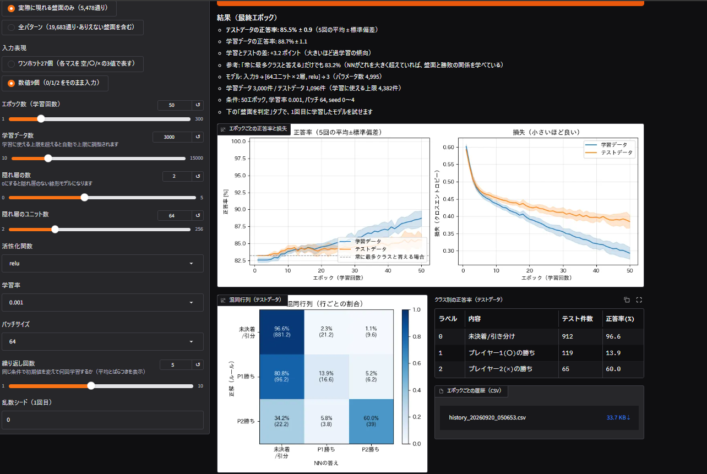
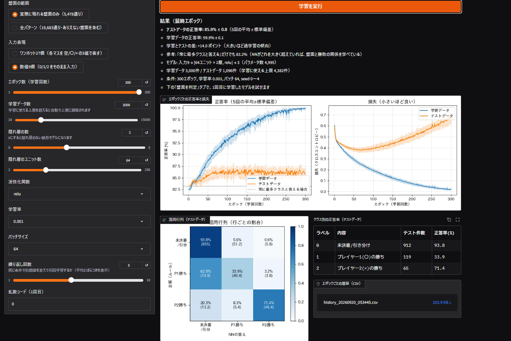
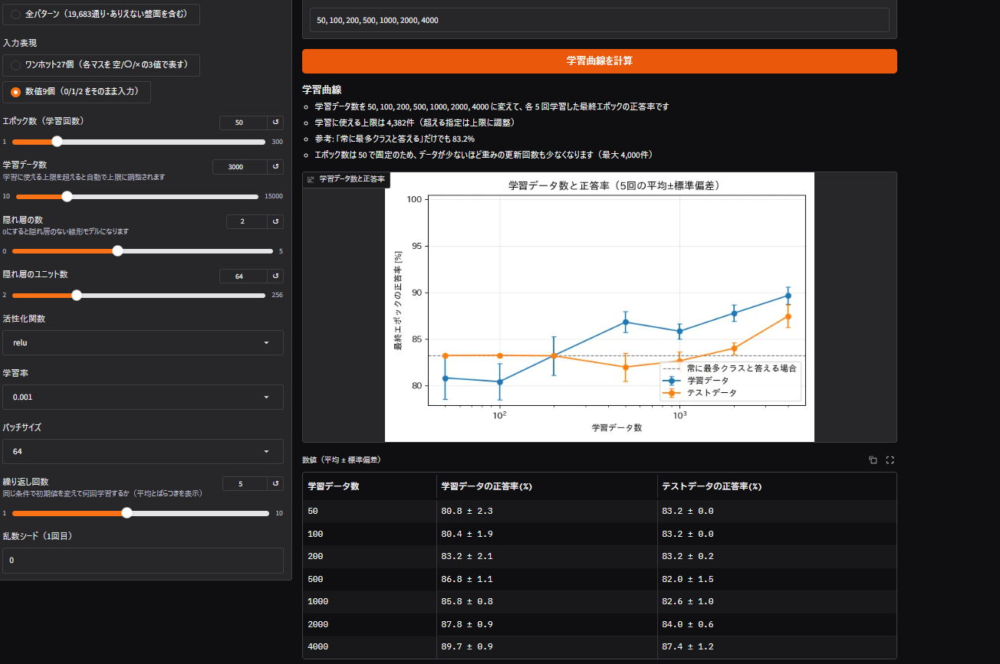
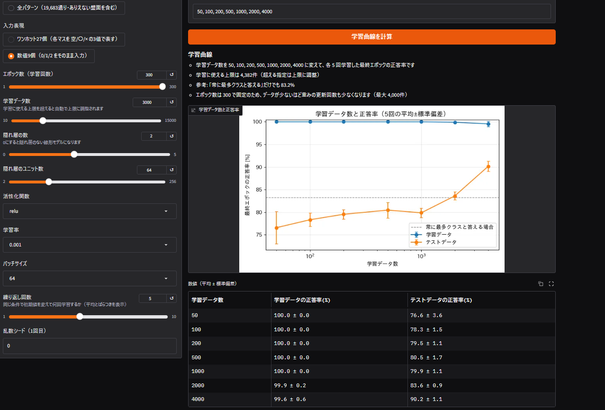
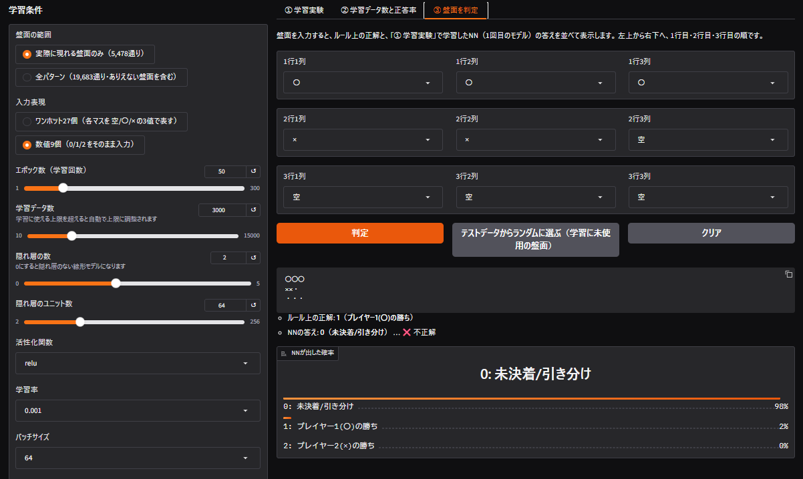

# 実験結果

入力表現とエポック数を変えて、学習の様子と正答率を比べた結果をまとめる。
数値は、Google Colab 上で実行した画面（スクリーンショット）に表示された値である。撮影日は 2026-09-20。
用語や指標の定義は [design.md](design.md) を参照。

## 共通の条件

| 項目 | 値 |
|---|---|
| 盤面の範囲 | 実際に現れる盤面のみ（5,478通り） |
| テストデータ | 1,096 件（ラベル0: 912、ラベル1: 119、ラベル2: 65）。全実験で共通 |
| 基準の正答率 | 83.2%（常に「0」と答える場合） |
| 学習データ数 | 3,000 件（タブ①）。タブ②では 50, 100, 200, 500, 1000, 2000, 4000 |
| ネットワーク | 隠れ層 2 層 × 64 ユニット、relu（パラメータ数: ワンホット 6,147 / 数値 4,995） |
| 学習率・バッチサイズ | 0.001・64 |
| 繰り返し | 5 回（乱数シード 0〜4）。表の値は平均±標準偏差 |

## 実験の一覧

| 実験 | 入力表現 | エポック数 |
|---|---|---|
| 実験1 | ワンホット27個 | 50 |
| 実験2 | 数値9個 | 50 |
| 実験3 | 数値9個 | 300 |

## 結果1: 学習実験（タブ①、学習データ 3,000 件）

| | 実験1 ワンホット・50 | 実験2 数値・50 | 実験3 数値・300 |
|---|---|---|---|
| テストデータの正答率 | **98.6% ± 0.3** | 85.5% ± 0.9 | 85.9% ± 0.8 |
| 学習データの正答率 | 100.0% ± 0.0 | 88.7% ± 1.1 | 99.9% ± 0.1 |
| 学習とテストの差 | +1.4 | +3.2 | +14.0 |
| 基準（83.2%）との差 | +15.4 | +2.3 | +2.7 |
| クラス0（未決着/引き分け）の正答率 | 98.9% | 96.6% | 93.8% |
| クラス1（プレイヤー1の勝ち）の正答率 | 98.2% | 13.9% | 33.9% |
| クラス2（プレイヤー2の勝ち）の正答率 | 94.8% | 60.0% | 71.4% |

| 実験1（ワンホット・50エポック） | 実験2（数値・50エポック） | 実験3（数値・300エポック） |
|---|---|---|
|  |  |  |

## 結果2: 学習データ数と正答率（タブ②）

最終エポックのテスト正答率（％、平均±標準偏差）。

| 学習データ数 | 実験1 ワンホット・50 | 実験2 数値・50 | 実験3 数値・300 |
|---|---|---|---|
| 50 | 83.2 ± 0.0 | 83.2 ± 0.0 | 76.6 ± 3.6 |
| 100 | 83.1 ± 0.4 | 83.2 ± 0.0 | 78.3 ± 1.5 |
| 200 | 83.3 ± 0.6 | 83.2 ± 0.2 | 79.5 ± 1.1 |
| 500 | 85.5 ± 1.0 | 82.0 ± 1.5 | 80.5 ± 1.7 |
| 1000 | 89.2 ± 0.5 | 82.6 ± 1.0 | 79.9 ± 1.1 |
| 2000 | 95.3 ± 0.8 | 84.0 ± 0.6 | 83.6 ± 0.9 |
| 4000 | **99.1 ± 0.2** | 87.4 ± 1.2 | 90.2 ± 1.1 |

学習データ側の正答率（％）。

| 学習データ数 | 実験1 | 実験2 | 実験3 |
|---|---|---|---|
| 50 | 80.8 ± 2.3 | 80.8 ± 2.3 | 100.0 ± 0.0 |
| 100 | 84.6 ± 3.5 | 80.4 ± 1.9 | 100.0 ± 0.0 |
| 200 | 88.9 ± 2.3 | 83.2 ± 2.1 | 100.0 ± 0.0 |
| 500 | 97.0 ± 1.8 | 86.8 ± 1.1 | 100.0 ± 0.0 |
| 1000 | 99.4 ± 0.4 | 85.8 ± 0.8 | 100.0 ± 0.0 |
| 2000 | 99.9 ± 0.1 | 87.8 ± 0.9 | 99.9 ± 0.2 |
| 4000 | 100.0 ± 0.0 | 89.7 ± 0.9 | 99.6 ± 0.6 |

| 実験1（ワンホット・50エポック） | 実験2（数値・50エポック） | 実験3（数値・300エポック） |
|---|---|---|
|  |  |  |

## 観察（数値から言えること）

1. **入力表現で、正答率が大きく変わった。** 同じ条件・同じデータで入力表現だけを変えた実験1と実験2では、テストの正答率が 98.6% と 85.5% だった。数値9個の方は、基準（83.2%）を 2.3 ポイント上回っただけである。
2. **数値9個では、プレイヤー1の勝ちをほとんど当てられなかった。** 実験2のクラス1の正答率は 13.9% で、混同行列ではクラス1の 80.8% が「0」と答えられていた。
3. **数値9個は、エポックを 6 倍（300）にしても、テストの正答率が上がらなかった。** 実験2（50エポック）は 85.5% ± 0.9、実験3（300エポック）は 85.9% ± 0.8 で、ばらつきの範囲内である。一方、学習データの正答率は 88.7% から 99.9% に上がった。学習とテストの差は +3.2 から +14.0 ポイントに開いた。
4. **実験3では、テストの損失が途中から増加した。** グラフ上では、テストの損失は約 50 エポック付近で最小（約 0.38）になり、その後は増え続けて 300 エポックでは約 0.7 に達した。学習データの損失は、ずっと下がり続けた。
5. **実験3の学習曲線は、学習データが 50〜1000 件のとき、すべてでテスト正答率が基準（83.2%）を下回った**（76.6〜80.5%）。学習データの正答率は、このとき 100% だった。
6. **ワンホットでは、学習データを増やすほど、テストの正答率が上がった。** 200 件までは基準（83.2%）と同程度で、500 件から基準を超え、4000 件で 99.1% になった。テストデータと学習プールを合わせた全盤面 5,478 通りのうち、4000 件は約 73% にあたる。
7. **実験1の学習データ 500 件では、学習が 97.0%、テストが 85.5%** と大きな差がある。この差は、学習データが増えるにつれて縮み、4000 件でほぼなくなった。

## 考察（仮説。今回の実験では検証していない）

- 数値9個で学習が進みにくいのは、〇が「1」、×が「2」、空が「0」という数値の大小関係が、〇と×の区別に不要な前提として入力に混ざるためではないか。ワンホットでは、「このマスは〇」がそのまま入力になっている。
- 実験3で基準を下回ったのは、学習データを暗記した結果、見たことのない盤面にも暗記した傾向を当てはめてしまったためではないか。
- 実験2から実験3で、エポックを増やしてもテストの正答率が上がらなかった原因が、数値9個という表現の問題なのか、このネットワークの大きさ（隠れ層 2×64）の問題なのかは、今回の実験では区別できていない。切り分けるには、隠れ層やユニット数を変えた数値9個の実験が必要である。

## 注意

- 各条件は、5回（乱数シード 0〜4）の平均である。標準偏差は、この5回のばらつきを示す。
- テストデータは 1,096 件で、クラス2は 65 件しかない。クラス別の正答率は、1件の違いで約 1.5 ポイント動く。
- 1つの学習/テスト分割（シード 42）での結果である。別の分割で同じになるかは、確かめていない。
- ここでの比較は、ネットワーク構成（隠れ層 2×64・relu）を固定したものである。構成を変えると、結果が変わる可能性がある。

## 画面の例（タブ③）

### 実験1のモデル

入力した盤面は、ルール上プレイヤー2の勝ち（右上・中央・左下の斜めが×）で、NNは 99% の確率で正しく答えている。
画面には、この盤面が「このモデルの学習に使われた盤面」であることも表示されている。学習に使われた盤面なので、覚えているだけの可能性がある。

### 実験2のモデル

入力した盤面は、ルール上プレイヤー1の勝ち（上段が〇の3つ並び）だが、NNは 98% の確率で「未決着/引き分け」と答えて不正解になっている。
このスクリーンショットを撮った時点のアプリには、「その盤面が学習に使われたか」を表示する機能がなかったため、この盤面が学習に使われたかどうかは不明である。

## 再現するには

1. アプリを起動する（[README](../README.md) を参照）。
2. 左の「学習条件」を、共通の条件のままにして、実験ごとに「入力表現」と「エポック数」だけを変える。
3. タブ①で「学習を実行」、タブ②で「学習曲線を計算」を押す（候補は既定値のまま）。

乱数シードが固定なので、同じ環境なら同じ結果になる。実験1は、別々の日・別々のセッションで2回実行し、画面に表示された数値（タブ①のテスト・学習の正答率とクラス別正答率、タブ②の表の全項目）が同じだった。ただし、PyTorchのバージョンやCPU/GPUの違いで、小数点以下が少し変わる可能性はある。
